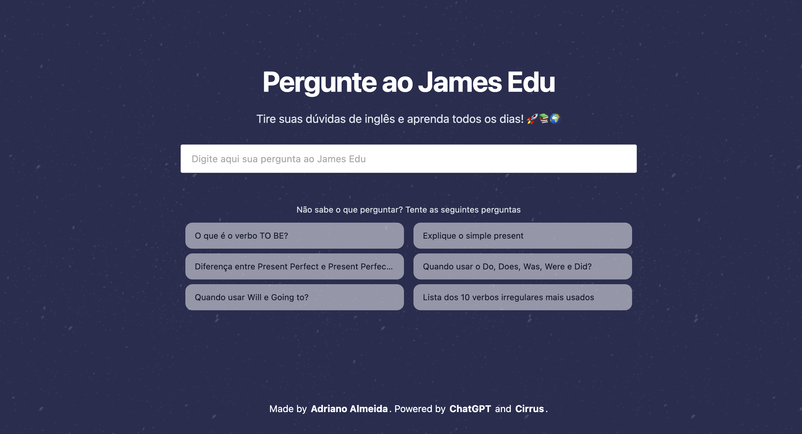

# JamesEdu
AI to answer questions about English

## ✨ Features
- Auth Magic links 🪄 with supabase
- Ask questions about English

## 🏗️ Built With

- ⚡ [Next.js](https://nextjs.org/)
- ☁ [Cirrus](https://www.cirrus-ui.com/)
- 🤖 [OpenAI](https://chat.openai.com/chat)

## 🖥 Public access

- 🤹🏼‍♀️ [Ask James Edu](https://ask-james-edu.vercel.app/)
- 📱 [Instagram](https://www.instagram.com/jamesedu.ingles/)

## 📷 Preview

## ✅ Next Steps
- [x] Integration openAI gpt3.5-turbo
- [x] Login with magic links supabase
- [ ] Limit 5 questions per day
